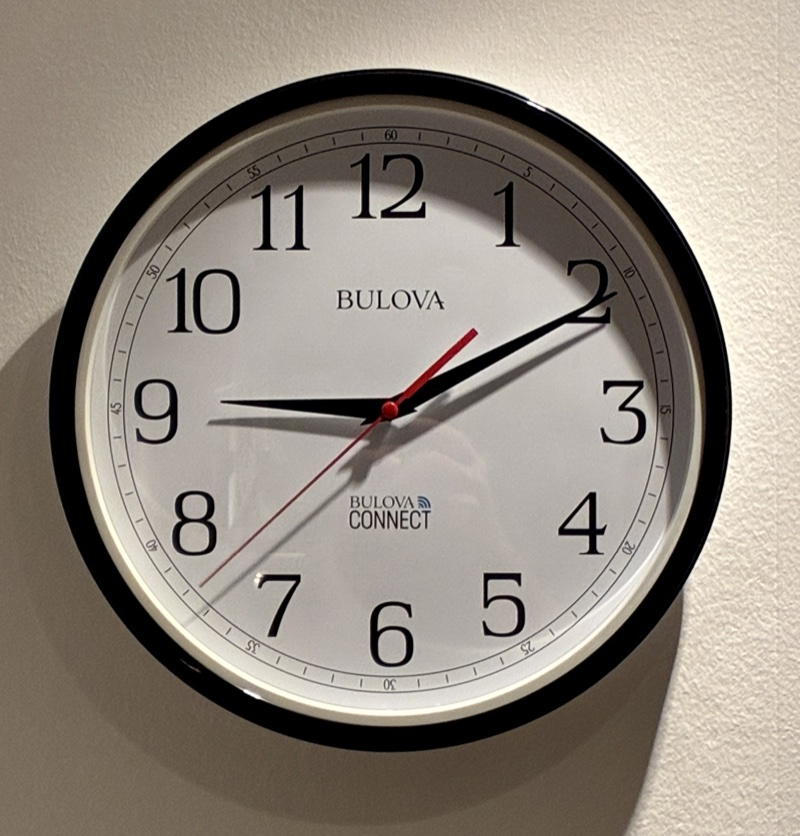

# Bulova Connect clock stub

A small local server that brings a **Bulova Connect** WiFi wall clock back
to life after its cloud services stopped working.

<p align="center">
  
</p>

If your Bulova Connect clock no longer sets itself, with the hands parked at
12 and the LCD showing `01-01-2017 00:00:00` before it goes blank, this may
fix it. The server
pretends to be the web APIs the clock calls during a sync. You run it on
your LAN and have your router redirect the clock's traffic to it.

> **Status:** works on one clock (a Bulova C5000, in Copenhagen) since
> October 2026. Other locations run correctly against the stub's own tests
> but have not been tried on a real clock yet. Reports welcome.

## Why the clock stopped syncing

The clock gets the time over NTP, which still works. It also has to know
where it is, to pick the time zone, and it finds that out over plain HTTP:

1. `GET http://112.74.23.39:4000/getWifiInfo`: the vendor's server. It is
   now unreachable.
2. `GET http://api.map.baidu.com/location/ip`: Baidu IP geolocation. The
   API key built into the firmware is over its quota.
3. `GET http://dataservice.accuweather.com/locations/v1/cities/geoposition/search`:
   AccuWeather location lookup, which supplies the time zone. AccuWeather
   now answers with a `301` redirect to https, and the clock never follows
   it.
4. `GET .../currentconditions/v1/<key>` and
   `GET .../forecasts/v1/daily/5day/<key>`: weather, once the time is set.

Without a location the clock retries every 8–9 seconds for a few minutes,
then gives up: the LCD briefly shows `01-01-2017 00:00:00`, then goes out,
and the hands stay at 12 o'clock.

## What the stub does

| Endpoint | Stub reply |
|---|---|
| `/getWifiInfo` | `404` on purpose. A `200` makes the clock stall for about 5 minutes, then it continues just the same. |
| Baidu `/location/ip` | Canned success for the configured city. |
| AccuWeather geoposition search | Canned city. The `TimeZone` block (offset, DST flag, next offset change) is computed live from the IANA time zone database. |
| AccuWeather current conditions and 5-day forecast | Live weather from [Open-Meteo](https://open-meteo.com/) (free, no API key), converted to AccuWeather's format and cached for 30 minutes. |
| Anything else | Logged, then `404`. |

Every request is logged with its headers, which helps when you are working
out what your own clock is doing.

### The catch that took longest to find

The firmware seems to read each HTTP reply with a single `recv()`. Flask's
development server (Werkzeug) sends the headers and the body in separate
TCP segments, so the clock saw replies with no body and rejected them.
`server.py` uses a buffered request handler that sends each reply as one
segment, and keeps every reply under one segment's size (1460 bytes). The
reply bodies are trimmed for this, and a test guards it.

So **always start it with `python server.py`, never `flask run`**: `flask
run` bypasses that handler, and the clock will not sync.

## Requirements

- Python 3.9 or later (developed on 3.12), with `flask` and `certifi`.
- A machine on your LAN that stays on, such as a NAS, a Raspberry Pi or a
  home server. The clock resyncs every night, between 03:00 and 05:00.
- A router that can **DNAT** (port-forward) the clock's outgoing port-80
  and port-4000 traffic to that machine. See [Router setup](#router-setup).
- Outbound HTTPS from the stub to `api.open-meteo.com` (weather), and to
  `geocoding-api.open-meteo.com` at startup if you pass `--city`.

## Running it

### Directly

```sh
python -m venv .venv
.venv/bin/pip install -r requirements.txt
.venv/bin/python server.py --port 8080
```

At startup it logs the location it will report, then every request.

### With Docker

```sh
docker compose up -d --build
```

The image build runs the test suite and fails if any test fails. The
container uses host networking, so that no Docker proxy re-segments the
replies, and it restarts unless stopped. On a Synology NAS this works as a
Container Manager project pointed at the repo folder.

To change the port, edit `command:` in `docker-compose.yml` and your DNAT
rule together.

### Choosing the location

The default is Copenhagen. To use another city:

```sh
python server.py --city Portland --country-code US
python server.py --city Adelaide
python server.py --city "My Town" --lat 51.5 --lon -0.12 --tz Europe/London
```

`--city` is looked up once at startup with Open-Meteo's geocoder, and the
most populous match wins, so add `--country-code` when the name is
ambiguous. `--lat`, `--lon` and `--tz` override individual fields. A bad
city or time zone stops the stub at startup, not on the clock's first
request.

Not yet known: whether the firmware handles time zones with a fractional
offset (India's +5:30, for example) or with no DST. If you try one, please
open an issue with the result.

## Router setup

Redirect the clock's traffic, matched on the clock's IP address, to the
stub's IP and port:

| Clock destination | Redirect to |
|---|---|
| any host, TCP port 80 (Baidu, AccuWeather) | `<stub-ip>:8080` |
| `112.74.23.39`, TCP port 4000 (`getWifiInfo`) | `<stub-ip>:8080` |

Leave NTP (UDP 123) alone. The stub matches requests on their path, so it
does not matter which host the clock thought it was calling.

**A DNS override might also work, but it is untested.** In packet
captures of one clock, it used the DNS server handed out by the network
(the router), not a hardcoded one. So pointing `api.map.baidu.com` and `dataservice.accuweather.com` at the
stub, with a router or Pi-hole override, could replace the port-80 rule.
The stub would then have to listen on port 80 itself. `getWifiInfo` is
called by IP address, so DNS cannot redirect it. Whether the clock still
syncs when that call goes unanswered has not been tested.

Then press **SET** briefly on the clock to start a sync. (Holding it for
more than 3 seconds enters manual time setting instead.) On success the LCD
runs through "Check Version", "Get City", "Get Weather" and "Get Time",
then shows **"Hands Calibrate"**, and the hands sweep to the right time.
If it does not, the stub's log shows which calls arrived and how far the
clock got.

To undo everything, remove the DNAT rule. The stub leaves nothing on the
clock, and the next sync goes to the real APIs again.

## Tests

```sh
.venv/bin/pip install pytest
.venv/bin/pytest test_server.py
```

The suite needs no network: Open-Meteo is mocked with a real reply. It
replays the clock's captured request headers, checks reply shapes, sizes
and compact JSON, and checks the time zone fields against the EU DST rule
hour by hour through 2035. It also serves the app on loopback to check
that one `recv()` gets a whole reply, with a control showing that stock
Werkzeug fails the same check.

What it cannot tell you is whether the firmware *accepts* a reply. Only a
real clock can show that.

## Repository layout

| Path | Contents |
|---|---|
| `server.py` | The stub. |
| `test_server.py` | The test suite. |
| `Dockerfile`, `docker-compose.yml` | Container setup. |

## Not affiliated

This project is not affiliated with or endorsed by Bulova, Citizen Watch,
AccuWeather, Baidu or Open-Meteo. It only answers your own clock on your
own network.
